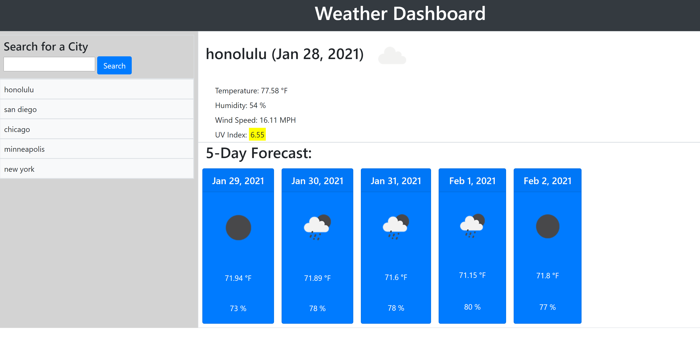

# Weather Dashboard

## Purpose
A web-based dashboard built to show the current weather in a city of choice and the upcoming 5 day forecast for that city

Enter in your city of choice and select search to view the current weather, temperature, humidity, wind speed, and UV Index for that city at the current time. Upon the search, the dashboard will also display the weather, temperature and hummidity forecast for the next 5 days. 

UV Index will be accompanied by a color indicating the severity of the index. Favorable is shown in green, moderate is shown in yellow, and severe is shown in red. 

Previous searches are saved in localStorage and the 5 most recent searches are available as buttons in order for easy access and re-searching of weather and forecasts

## Built With
* HTML
* CSS
* Javascript
* Open Weather APIs - Current Weather Data, UV Index and 5 day/ 3 Hour Forecast
* Bootstrap API
* Moment.js API

## Contribution
Made by Sam Meier
